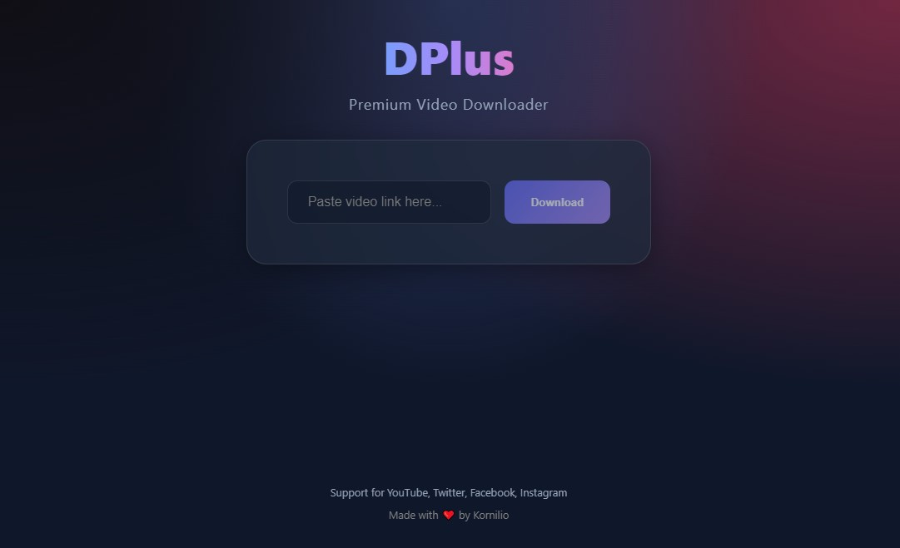

# DPlus - Premium Video Downloader

DPlus is a high-performance, professional video downloader for Windows. It provides a seamless experience for downloading videos from major platforms including **YouTube**, **Twitter (X)**, **Facebook**, and **Instagram**, with a heavy focus on user experience and visual excellence.



---

## ✨ Features

- **Multi-Platform Excellence**: Seamlessly download content from YouTube, Twitter (X), Facebook, and Instagram.
- **Intelligent Multi-Screen Flow**: Replaced clunky modals with a smooth, inline multi-step process for a truly premium feel.
- **Auto-Deduplication**: Intelligent backend logic detects and removes duplicate video entries (common on Twitter) to ensure you only download what you need.
- **High-Fidelity Merging**: Integrated FFmpeg to ensure the highest quality video and audio are merged into a single, perfect file.
- **Smart Batch selection**: A dedicated selection screen for posts with multiple videos, featuring a 16:9 grid with 3 items per row and auto-skip for single videos.
- **Customizable Naming**: A dedicated naming screen for individual or batch downloads, complete with thumbnail previews and Windows-safe filename sanitization.
- **Real-time Progress Engine**: Precise progress tracking with a dynamic visual progress bar for both individual and batch jobs.
- **Premium Glassmorphic UI**: Modern design featuring smooth transitions, blur effects, and intuitive "Back" navigation.
- **Zero-Install Portable**: Single `.exe` binary that runs anywhere—no installation or admin rights required.

---

## 🚀 Getting Started

### For Users
The latest **Portable Windows version (v1.1.1)** is available in the [GitHub Releases](https://github.com/Kornilio/DPlus/releases) section.

1. Download `DPlus_Portable_1.1.1.exe`.
2. Run the application.
3. Paste your video link and hit **Download**.
4. **Select Videos**: Choose which clips to keep (skipped if only one).
5. **Name Files**: Enter your preferred names for the videos.
6. **Download**: Hit "Start Download" and the app will handle the rest.

### For Developers
If you wish to build DPlus from source:

1. **Clone the repository**:
   ```bash
   git clone https://github.com/Kornilio0101/DPlus.git
   cd DPlus/dplus
   ```

2. **Install dependencies**:
   ```bash
   npm install
   ```

3. **Run in development mode**:
   ```bash
   npm run dev
   ```

4. **Build for production**:
   ```bash
   npm run package
   ```

---

## 🛠️ Tech Stack & Architecture

- **Core Framework**: [Electron](https://www.electronjs.org/) (Cross-platform desktop integration)
- **Frontend**: [React](https://reactjs.org/) + [Vite](https://vitejs.dev/) (High-performance UI rendering)
- **Engine**: [yt-dlp](https://github.com/yt-dlp/yt-dlp) & [FFmpeg](https://ffmpeg.org/) (Bundled for maximum quality and audio/video merging)
- **Styling**: Vanilla CSS with **Glassmorphism** and **Responsive Grid** layouts
- **Language**: [TypeScript](https://www.typescriptlang.org/) (Type-safe codebase)

---

## 📝 Multi-Screen Usage Flow

1. **Paste Link**: Insert your video URL into the primary input field.
2. **Select Videos**: If multiple videos are found, a grid appears. Select your choices.
3. **Customize Naming**: Confirm or edit filenames on the naming screen.
4. **Download**: Watch the real-time progress as your video is saved and the destination folder is opened automatically.
5. **Navigation**: Use the "Back" button at any time to return to a previous step.

---

Made with ❤️ by [Kornilio](https://github.com/Kornilio0101)
